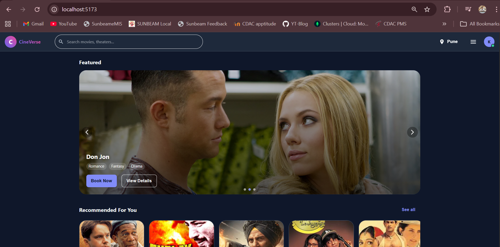

# 🎬 CineVerse - Online Movie Booking System

CineVerse is a scalable **microservices-based online movie ticket booking platform** inspired by modern booking applications like BookMyShow. The platform enables users to browse movies, select seats, book tickets securely, and receive booking confirmations, while providing administrators with tools to manage movies, theatres, and shows.

The application follows a distributed architecture using Spring Boot, Node.js, React, Docker, and cloud-native technologies to ensure scalability, maintainability, and fault tolerance.

---

## 🚀 Features

### 👤 User Features
- User Registration & Login
- JWT Authentication & Authorization
- Browse Movies
- View Movie Details
- Search Movies
- Filter by Genre
- View Available Shows
- Real-Time Seat Selection
- Secure Ticket Booking
- Razorpay Payment Integration
- Booking History
- Booking Confirmation Email
- Responsive User Interface

### 🛠 Admin Features
- Admin Login
- Add/Edit/Delete Movies
- Manage Theatres
- Manage Screens
- Manage Show Timings
- View Bookings
- Manage Users
- Dashboard Analytics

---

# 💻 Tech Stack

## Frontend

- React.js
- Redux Toolkit
- React Router
- Axios
- Bootstrap / CSS

---

## Backend

### User Service
- Node.js
- Express.js
- MySQL
- JWT Authentication
- BCrypt

### Movie Service
- Spring Boot
- Spring Data MongoDB
- REST APIs

### Booking Service
- Spring Boot
- MongoDB
- Razorpay API

### Notification Service
- Spring Boot
- Java Mail Sender
- SMTP

---

## Databases

- MySQL
- MongoDB

---

## DevOps

- Docker
- Docker Compose
- AWS EC2
- GitHub

---

## API Documentation

- Swagger UI

---

# 📁 Project Structure

```
cineverse/
│
├── frontend/
│   ├── src/
│   ├── public/
│   └── package.json
│
├── api-gateway/
│
├── eureka-server/
│
├── user-service/
│
├── movie-service/
│
├── booking-service/
│
├── notification-service/
│
├── docker-compose.yml
│
└── README.md
```

---

# ⚙ Microservices

## 1. API Gateway

Responsible for

- Routing Requests
- Authentication Filter
- Load Balancing
- Centralized Entry Point

Technology

- Spring Cloud Gateway

---

## 2. Eureka Server

Responsible for

- Service Discovery
- Dynamic Registration

Technology

- Spring Cloud Netflix Eureka

---

## 3. User Service

Responsible for

- Registration
- Login
- JWT Authentication
- User Management

Database

MySQL

Technology

- Node.js
- Express.js

---

## 4. Movie Service

Responsible for

- Movies
- Genres
- Show Details
- Theatre Information

Database

MongoDB

Technology

- Spring Boot

---

## 5. Booking Service

Responsible for

- Seat Booking
- Payment Verification
- Ticket Generation
- Booking History

Database

MongoDB

Technology

- Spring Boot

---

## 6. Notification Service

Responsible for

- Booking Confirmation Email
- Payment Success Email

Technology

- Spring Boot
- Java Mail

---

# 🔐 Authentication

- JWT Authentication
- BCrypt Password Encryption
- Protected APIs
- Role Based Access Control

Roles

- USER
- ADMIN

---

# 💳 Payment Gateway

Integrated with

- Razorpay

Features

- Secure Checkout
- Payment Verification
- Booking Confirmation

---

# 📧 Email Notifications

Users receive

- Booking Confirmation
- Payment Receipt
- Ticket Details

---

# 🔄 Booking Workflow

```
User Login
      │
Browse Movies
      │
Select Show
      │
Choose Seats
      │
Proceed Payment
      │
Payment Success
      │
Booking Stored
      │
Confirmation Email
```

---

# 🌐 API Endpoints

## Authentication

| Method | Endpoint |
|----------|----------------|
| POST | /auth/register |
| POST | /auth/login |

---

## Movies

| Method | Endpoint |
|----------|----------------|
| GET | /movies |
| GET | /movies/{id} |
| POST | /movies |
| PUT | /movies/{id} |
| DELETE | /movies/{id} |

---

## Booking

| Method | Endpoint |
|----------|----------------|
| POST | /booking |
| GET | /booking/history |
| POST | /payment |

---

# 📸 Screenshots




<!-- Login

Movie Details

Seat Selection

Payment

Booking Confirmation

Admin Dashboard -->


---

# 🔮 Future Enhancements

- Live Seat Locking
- Recommendation System
- Coupon Management
- Reviews & Ratings
- Push Notifications
- QR Code Ticket
- Mobile Application
- AI Movie Recommendations
- Multi-language Support

---

# 📚 Learning Outcomes

Through this project, we gained practical experience in:

- Microservices Architecture
- RESTful API Development
- Spring Boot
- Node.js
- React.js
- JWT Authentication
- MongoDB
- MySQL
- Docker
- API Gateway
- Service Discovery
- Payment Gateway Integration
- Cloud Deployment
- Secure Backend Development


